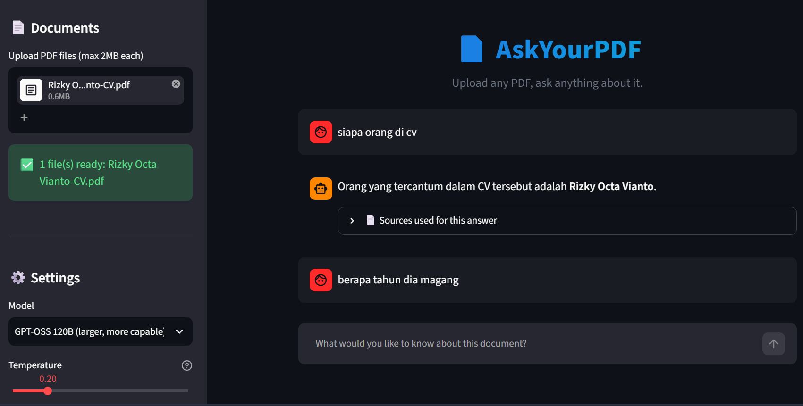

# 📄 AskYourPDF: RAG Chatbot with LangChain & Groq LLM

<!-- Ganti baris di bawah dengan screenshot aplikasi kamu -->


A Retrieval-Augmented Generation (RAG) chatbot built with **Streamlit**, **LangChain (LCEL)**, and **Groq Cloud API**. Upload any PDF and ask questions about it — answers are grounded strictly in the document's content to minimize LLM hallucinations.

---

[]([#](https://chatbot-rag-for-file-pdf-using-langchain-and-groq-api-js9wvkow.streamlit.app/)) 
**Live Demo:** [AskYourPDF](https://chatbot-rag-for-file-pdf-using-langchain-and-groq-api-js9wvkow.streamlit.app/) 

## 🚀 Key Features

* **Upload Any PDF:** Users upload their own PDF documents directly through the UI (max 2MB per file, multiple files supported) — no fixed dataset required.
* **Multi-Model Selection:** Switch between four Groq-hosted models at runtime (`GPT-OSS 20B`, `GPT-OSS 120B`, `Llama 3.3 70B Versatile`, `Llama 3.1 8B Instant`) without rebuilding the vector index.
* **Retrieval-Augmented Generation (RAG):** Grounds LLM responses strictly on the retrieved document context.
* **Source Transparency:** Displays the exact document chunks used to generate each answer, so users can verify the response.
* **Ultra-Fast Inference:** Powered by Groq's LPU acceleration via `ChatGroq`.
* **Modern LCEL Architecture:** Built using LangChain Expression Language (`RunnablePassthrough`, modern prompt formatting, and output parsers).
* **Efficient Vector Storage:** Embeds text chunks with HuggingFace's `all-MiniLM-L6-v2` and searches via an in-memory `FAISS` vector index.
* **Cached, Model-Independent Pipeline:** Embeddings are cached by document content via `@st.cache_resource`, so switching models does not trigger re-embedding.
* **Configurable Generation:** Adjustable temperature slider for more factual vs. more exploratory answers.

---

## 🛠 Tech Stack

* **Frontend / UI:** Streamlit
* **Orchestration Framework:** LangChain, LangChain Core, LangChain Community
* **LLM Engine:** Groq API (`ChatGroq`) — multi-model support
* **Vector Store & Retrieval:** FAISS (CPU), `sentence-transformers` via `langchain-huggingface`
* **Document Processing:** PyPDF (`PyPDFDirectoryLoader`), `langchain-text-splitters`
* **Environment Management:** `python-dotenv`

---

## 📁 Repository Structure

```text
├── .gitignore              # Git exclusion rules (e.g., .env, venv)
|── README.md               # Project documentation
├── app.py                  # Streamlit UI & LCEL RAG pipeline
├── requirements.txt        # Project dependencies

```

> Note: earlier versions of this project read from a fixed `DB/` folder containing a single football-stats PDF. The app has since been generalized — documents are now uploaded by the user at runtime, so no bundled dataset is required.

---

## 🧠 System Workflow

1. **Document Upload:** The user uploads one or more PDF files (max 2MB each) directly through the sidebar.
2. **Text Chunking:** Text is extracted via `PyPDFDirectoryLoader` and split using `RecursiveCharacterTextSplitter` (chunk size: 1000, overlap: 200).
3. **Vector Embeddings & Indexing:** Chunks are embedded using `sentence-transformers/all-MiniLM-L6-v2` and indexed into an in-memory `FAISS` vector index, cached by file content.
4. **Contextual Retrieval:** The retriever fetches the top 3 (`k=3`) passages most relevant to the user's question.
5. **LCEL Generation Chain:**

$$\text{Retriever} \longrightarrow \text{Format Context} \longrightarrow \text{Prompt Template} \longrightarrow \text{Groq LLM} \longrightarrow \text{StrOutputParser}$$

6. **Source Display:** Retrieved chunks are shown alongside the answer for verification.

---

## ⚙️ Installation & Local Setup

1. **Clone this repository:**
```bash
git clone https://github.com/katarizkyo99/Chatbot-RAG-for-File-PDF-using-Langchain-and-Groq-API.git
cd Chatbot-RAG-for-File-PDF-using-Langchain-and-Groq-API
```

2. **Create and activate a virtual environment:**
```bash
python -m venv venv
source venv/bin/activate    # macOS / Linux
venv\Scripts\activate       # Windows
```

3. **Install dependencies:**
```bash
pip install -r requirements.txt
```

4. **Set up environment variables:**
Create a `.env` file in the root directory (do not commit this file):
```env
GROQ_API_KEY=your_groq_api_key_here
```

5. **Run the Streamlit application:**
```bash
streamlit run app.py
```

6. **Use the app:** upload a PDF (max 2MB) in the sidebar, pick a model, and start asking questions.

---

## ☁️ Deployment Configuration (Streamlit Cloud)

When deploying to Streamlit Community Cloud:

1. Push your repository without the `.env` file.
2. In the **Streamlit Cloud Dashboard**, open your application settings:
   * Navigate to **Settings** > **Secrets**.
   * Add your Groq API key:
     ```toml
     GROQ_API_KEY = "your_actual_groq_api_key"
     ```
3. Set the main file path to `app.py`.
4. Deploy the application.

---

## 👤 Author

* **GitHub:** [@katarizkyo99](https://github.com/katarizkyo99)
